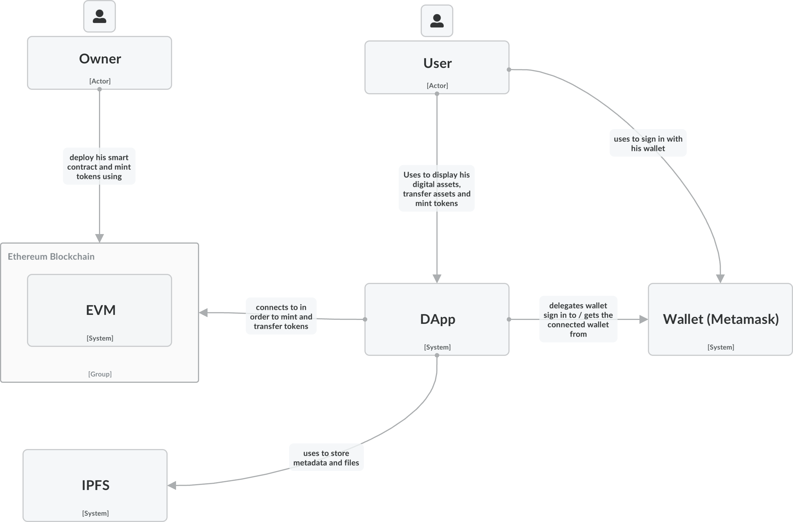
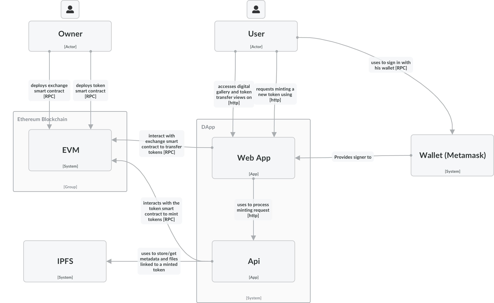

# Full-Stack Javascript Developer Task - Web3  Integration

# Table of Contents

[Announcement](#announcement)<br><br>
[Live Application](#live-application)<br><br>
[Technical Summary](#technical-summary)<br><br>
[1. How to Run](#1-how-to-run)<br>
&nbsp;&nbsp;[1.1 Decide which network to use](#11-decide-which-network-to-use)<br>
&nbsp;&nbsp;[1.2 Env variables](#12-env-variables)<br>
&nbsp;&nbsp;[1.3 Run the application using docker](#13-run-the-application-using-docker)<br>
&nbsp;&nbsp;[1.4 Run the application manually in the terminal](#14-run-the-application-manually-in-the-terminal)<br><br>
[2. Contract and Solidity](#2-contract-and-solidity)<br><br>
[3. Requirements](#3-requirements)<br><br>
[4. Assumptions and Approach](#4-development-assumptions-and-approach)<br>
&nbsp;&nbsp;[4.1 Assumptions](#41-assumptions)<br>
&nbsp;&nbsp;[4.2 Approach](#42-approach)<br><br>
[5. DApp Overview](#5-dapp-overview)<br>
&nbsp;&nbsp;[5.1 Who can mint (assumption)](#51-who-can-mint-(assumption))<br>
&nbsp;&nbsp;[5.2 Overview](#52-overview)<br><br>
[6. Architecture](#6-architecture)<br>
&nbsp;&nbsp;[6.1 Monorepo](#61-monorepo)<br>
&nbsp;&nbsp;[6.2 C4 Model](#62-c4-model)<br>
&nbsp;&nbsp;&nbsp;&nbsp;[6.2.1 C1 System Context](#621-c1-system-context)<br>
&nbsp;&nbsp;&nbsp;&nbsp;[6.2.2 C2 Container](#622-c2-container)<br>
&nbsp;&nbsp;&nbsp;&nbsp;[6.2.3 Back-End](#623-back-end)<br>
&nbsp;&nbsp;&nbsp;&nbsp;[6.2.4 Front-End](#624-front-end)<br><br>
[7. Planning](#7-planning)<br><br>
[8. Git Messages](#8-git-messages)<br><br>
[9. TEchnologies Used](#9-technologies-used)


# Announcement

This project took me about 1+ week in total. I was working on another project in parallel which forced me to shift my focus away at some times

That being said I gave this project priority and I invested time to ensure that my skills were represented before sumitting

**Please note that I am aware that this project is over engineered and If it was a real project I would have done things much simpler and faster.**

# Live Application

**Please note that I will secure the website with an SSL certificate, but to save time I submitted it working on http for now. I will use certbot and integrate it with my already configured nginx server**

There are 2 environments: dev (better: don't require eth) and production(requires sepolia eth)

**Dev: [http://yeager-dev.elie-atamech.com](http://yeager.elie-atamech.com)**

Dev is connected to a hardhat network so you don't need to get sepolia eth to check the application

So you need to connect metamask to that hardhat network.

Url: `http://13.60.80.109:8545`
ChainId: 31337

*When minting multiple times you might need to clear metamask cache if an error regarding wrong nonce appears.*

Below are accounts you can use on that network

```
Account #0: 0xf39Fd6e51aad88F6F4ce6aB8827279cffFb92266 (10000 ETH)
Private Key: 0xac0974bec39a17e36ba4a6b4d238ff944bacb478cbed5efcae784d7bf4f2ff80

Account #1: 0x70997970C51812dc3A010C7d01b50e0d17dc79C8 (10000 ETH)
Private Key: 0x59c6995e998f97a5a0044966f0945389dc9e86dae88c7a8412f4603b6b78690d

Account #2: 0x3C44CdDdB6a900fa2b585dd299e03d12FA4293BC (10000 ETH)
Private Key: 0x5de4111afa1a4b94908f83103eb1f1706367c2e68ca870fc3fb9a804cdab365a

Account #3: 0x90F79bf6EB2c4f870365E785982E1f101E93b906 (10000 ETH)
Private Key: 0x7c852118294e51e653712a81e05800f419141751be58f605c371e15141b007a6

Account #4: 0x15d34AAf54267DB7D7c367839AAf71A00a2C6A65 (10000 ETH)
Private Key: 0x47e179ec197488593b187f80a00eb0da91f1b9d0b13f8733639f19c30a34926a

Account #5: 0x9965507D1a55bcC2695C58ba16FB37d819B0A4dc (10000 ETH)
Private Key: 0x8b3a350cf5c34c9194ca85829a2df0ec3153be0318b5e2d3348e872092edffba

Account #6: 0x976EA74026E726554dB657fA54763abd0C3a0aa9 (10000 ETH)
Private Key: 0x92db14e403b83dfe3df233f83dfa3a0d7096f21ca9b0d6d6b8d88b2b4ec1564e

Account #7: 0x14dC79964da2C08b23698B3D3cc7Ca32193d9955 (10000 ETH)
Private Key: 0x4bbbf85ce3377467afe5d46f804f221813b2bb87f24d81f60f1fcdbf7cbf4356

Account #8: 0x23618e81E3f5cdF7f54C3d65f7FBc0aBf5B21E8f (10000 ETH)
Private Key: 0xdbda1821b80551c9d65939329250298aa3472ba22feea921c0cf5d620ea67b97

Account #9: 0xa0Ee7A142d267C1f36714E4a8F75612F20a79720 (10000 ETH)
Private Key: 0x2a871d0798f97d79848a013d4936a73bf4cc922c825d33c1cf7073dff6d409c6

Account #10: 0xBcd4042DE499D14e55001CcbB24a551F3b954096 (10000 ETH)
Private Key: 0xf214f2b2cd398c806f84e317254e0f0b801d0643303237d97a22a48e01628897

Account #11: 0x71bE63f3384f5fb98995898A86B02Fb2426c5788 (10000 ETH)
Private Key: 0x701b615bbdfb9de65240bc28bd21bbc0d996645a3dd57e7b12bc2bdf6f192c82

Account #12: 0xFABB0ac9d68B0B445fB7357272Ff202C5651694a (10000 ETH)
Private Key: 0xa267530f49f8280200edf313ee7af6b827f2a8bce2897751d06a843f644967b1

Account #13: 0x1CBd3b2770909D4e10f157cABC84C7264073C9Ec (10000 ETH)
Private Key: 0x47c99abed3324a2707c28affff1267e45918ec8c3f20b8aa892e8b065d2942dd

Account #14: 0xdF3e18d64BC6A983f673Ab319CCaE4f1a57C7097 (10000 ETH)
Private Key: 0xc526ee95bf44d8fc405a158bb884d9d1238d99f0612e9f33d006bb0789009aaa

Account #15: 0xcd3B766CCDd6AE721141F452C550Ca635964ce71 (10000 ETH)
Private Key: 0x8166f546bab6da521a8369cab06c5d2b9e46670292d85c875ee9ec20e84ffb61

Account #16: 0x2546BcD3c84621e976D8185a91A922aE77ECEc30 (10000 ETH)
Private Key: 0xea6c44ac03bff858b476bba40716402b03e41b8e97e276d1baec7c37d42484a0

Account #17: 0xbDA5747bFD65F08deb54cb465eB87D40e51B197E (10000 ETH)
Private Key: 0x689af8efa8c651a91ad287602527f3af2fe9f6501a7ac4b061667b5a93e037fd

Account #18: 0xdD2FD4581271e230360230F9337D5c0430Bf44C0 (10000 ETH)
Private Key: 0xde9be858da4a475276426320d5e9262ecfc3ba460bfac56360bfa6c4c28b4ee0

Account #19: 0x8626f6940E2eb28930eFb4CeF49B2d1F2C9C1199 (10000 ETH)
Private Key: 0xdf57089febbacf7ba0bc227dafbffa9fc08a93fdc68e1e42411a14efcf23656e
```

**Production: [http://yeager.elie-atamech.com](http://yeager.elie-atamech.com)**

When you mint a token, the contract owner is doing it for you (explained later in the DApp overview section, but for short it's to avoid adding complexity to the token creation).

So if you face a `Problem occured` it is because the owner doesn't have enough sepolia ETH to mint new tokens. In that case please send the owner `0x47bd5885386087A5Efc6e2A0eA16074BBBa4002e` sepolia eth for the minting feature to work.


***I used [chain link](https://faucets.chain.link/sepolia) and [google faucet](https://cloud.google.com/application/web3/faucet/ethereum/sepolia) to get free sepolia ETH***

---

You can add `/en/` or `/fr` or `/it` ad the end of the url to set the language

I am running a docker image on aws ec2 to serve both the frontend and backend.

I faced issues with vercel because [it doesn't support yarn 4](https://vercel.com/guides/does-vercel-support-yarn-2). I was able to downgrade to yarn 1 and deploy both the backend and frontend on vercel but it was a messy process and i didn't like it

# Technical Summary

This is a brief list of the technical features implemented:

- Enforced consistent commit message conventions using `husky` and `commitlint`
- A monorepo built with yarn 4 and turbo
- Each workspace is self-contained and has it's own `node_modules` and config files (some extends root config files)
- Automated run scripts that use turbo to build dependencies
- Ability to run the application either locally with hardhat and a script to deploy the contract, or on sepolia testnet by changing env variables.
- Unit tests for the ERC 721 contract
- Shared code is written once for example the packages `dtos` and `nft` which are used on both the frontend and backend. This includes types and validation schemas
- Typescript typed code with module augmentation to provide types for some libraries (like the ethers Contract api)
- Clean architecture and cqrs on the backend. Standalone and unit tested Domain layer (`packages/domain`) that doesn't have external dependencies. Application layer (`backend/application`) that implement use cases, and infrastructure/presentation (`backend/api`) layer
- Restricting packages from wrongly depending on other packages (like the domain package depending on the application package) using yarn config `yarn.config.cjs`
- Express app with Api versioning support and error handling
- Just the needed Inversion of control without a DI library
- Logging with `winston`
- Zod for validation
- Multer for file uploads
- Vue js application focused on good structure (sepeartion by concern). Protected, shared and public routes, minimal use of libraries and manual implementation of Toasts,Theming and i18n.
- Metamask integration through ethers.js
- useForm composable with advanced type inferring, integrated with zod and custom controlled inputs for easy form creation, submission and validation 
- Internalization and support of english, italian and french

## 1. How to Run

**You can run all the application locally using docker images or manually in the terminal.**

*I used yarn version `4.5.0` and `turbo`<br>
The development was done on wsl 2 (ubuntu)*

1. Make sure to use yarn 4. If possible run `nvm use` to switch to the correct version

2. Run `yarn install` from the root dir

3. Create a free account on Pinata to get the API keys

4. Install metamask extension

### 1.1 Decide which network to use

You can use a local hardhat blockchain network or sepolia testnet.

**To run on hardhat:**

1. From the roor dir, build the docker image with this dommand `docker build -t yeager-hardhat -f packages/nft/Dockerfile .`

Run the image: `docker run -d -p 8545:8545 -t yeager-hardhat`

Get the docker container id with `docker container ps`

2. Deploy the contract by running `docker exec <container_id> yarn run deploy-contract-local`

Or You can use (Remix ethereum)[https://remix.ethereum.org/] to connect your local file system by going to `packages/nft` and running `remixd`, then from (Remix ethereum)[https://remix.ethereum.org/] connecting to localhost

*Use the compiler version 0.8.20 to compile and deploy the contract*

By default the contract will be deployed from the first account provided by hardhat.

```
Account #0: 0xf39Fd6e51aad88F6F4ce6aB8827279cffFb92266 (10000 ETH)
Private Key: 0xac0974bec39a17e36ba4a6b4d238ff944bacb478cbed5efcae784d7bf4f2ff80
```

You will later use these as env variables for the application

Through metamask connect to hardhat by providing the network url of hardhat and the hardhat default chain id (31337)

**To run on sepolia**

If you want to use the contract I already deployed on sepolia then you only need to save its address: `0x47bd5885386087A5Efc6e2A0eA16074BBBa4002e` ([tesnet scanner](https://sepolia.etherscan.io/address/0x47bd5885386087A5Efc6e2A0eA16074BBBa4002e))

If you want you can create a new erc 721 on sepolia with the contract in `packages/nft/contracts/token.sol` and save its address

The saved contract address will be later used as env variable for the application

### 1.2 Env variables

The backend application needs the env variables below:

**`NODE_ENV`** Development<br>
**`PORT`**  3000<br>
**`PINATA_JWT`**  Your pinata jwt<br>
**`PINATA_GATEWAY_URL`**  Your pinata gateway (https://salmon-defiant-me....)<br>
**`NETWORK`** Hardhat or Sepolia<br>
**`WALLET_PRIVATE_KEY`**  The private key used to deploy the contract<br>
**`CONTRACT_ADDRESS`** The contract address<br>
**`INFURA_API_KEY`**  You need a valid key only if you are running on sepolia network. Otherwise you can provide any value<br>
**`WEB_APP_URL`**  The frontend url<br>

The frontend application needs the env variables below:

**`VITE_NETWORK`** Hardhat or Sepolia<br>
**`VITE_APP_NAME`** Yeager DApp<br>
**`VITE_HOST_URL`** The backend url (http://localhost:3000)<br>
**`VITE_CONTRACT_ADDRESS`** The contract address<br>
**`VITE_PINATA_GATEWAY_URL`** Your pinata gateway url<br>

### 1.3 Run the application using docker

Docker images are the easier and faster way to run the application.

In the future docker compose should be used to automate the process but for now i am running the containers manually

Please follow these steps to build and run the containers.

1. Go to `backend/api/Dockerfile` and update the env variables with your values (on line 45) 

In the root directory in the terminal run `docker build -t yeager-backend -f backend/api/Dockerfile .`

Then run the backend with this command `docker run -d -p <your_port>:80 -t yeager-backend` and map the ports

Ex: `docker run -d -p 8080:80 -t yeager-backend`

2. In the root directory in the terminal run `docker build -t yeager-frontend -f frontend/app/Dockerfile .`

Then run the frontend with this command `docker run -d -t yeager-frontend` and **pass it the backend env variables** from above and map the ports

**Notice here the env variables start with `MY_`**

Ex: 

for hardhat
```
`docker run --env=MY_VITE_NODE_ENV=Development --env=MY_VITE_NETWORK=Hardhat --env=MY_VITE_NETWORK_URL=http://13.60.80.109:8545 --env=MY_VITE_CHAIN_ID=31337 --env=MY_VITE_APP_NAME="Yeager DApp" --env=MY_VITE_HOST_URL=http://13.60.80.109:80 --env=MY_VITE_CONTRACT_ADDRESS=0x5FbDB2315678afecb367f032d93F642f64180aa3 --env=MY_VITE_PINATA_GATEWAY_URL=https://salmon-defiant-meerkat-23.mypinata.cloud/ipfs -p 3000:80 -d elie101001/yeager-frontend:latest`
```


for sepolia
```
`docker run --env=MY_VITE_NODE_ENV=Development --env=MY_VITE_NETWORK=Sepolia --env=MY_VITE_NETWORK_URL=https://sepolia.infura.io/v3 --env=MY_VITE_CHAIN_ID=11155111 --env=MY_VITE_APP_NAME="Yeager DApp" --env=MY_VITE_HOST_URL=http://localhost:8080 --env=MY_VITE_CONTRACT_ADDRESS=0x47bd5885386087A5Efc6e2A0eA16074BBBa4002e --env=MY_VITE_PINATA_GATEWAY_URL=YOUR_PINATA_GATEWAY_URL -p 3000:80 -d yeager-frontend:latest`
```

**By now the application is running, you can skip to the next section.**

### 1.4 Run the application manually in the terminal

1. create a `.env` file under `backend/api` and add to it the backend env variables.

Ex: 
```
NODE_ENV=Development
PORT=8080
PINATA_JWT=...
PINATA_GATEWAY_URL=...
NETWORK=Sepolia
WALLET_PRIVATE_KEY=...
CONTRACT_ADDRESS=...
INFURA_API_KEY=...
WEB_APP_URL=http://localhost:5173

```

2. create a `.env` file under `frontend/app` and add to it the frontend env variables:

Ex:
```
VITE_NODE_ENV=Development
VITE_NETWORK=Sepolia
VITE_APP_NAME=Yeager DApp
VITE_HOST_URL=http://localhost:80
VITE_CONTRACT_ADDRESS=...
VITE_PINATA_GATEWAY_URL=...
```

3. run `yarn run frontend-dev` in a seperate terminal from the root dir

4. run `yarn run backend-dev` in a seperate temrinal from the root dir

If needed, in the `backend/api/.env` file you created previously replace the **WEB_APP_URL** key with the url of the front end app (by default `http://localhost:5173/`) and rerun `yarn run backend-dev`

By now the backend and frontend applications are running

## 2. Contract and Solidity

*After confirming with Araceli Martinez that the link provided for the smart contract in the requirement documents is not working, I used an industry standard ERC-721 contract from Oppenzeppelin*

As stated by Araceli Martinez my role is to have a full undestanding of the Web3 and its ecosystem without being an expert in contract creation and solidity.

## 3. Requirements

This is the original [Fullstack_js_-_Web3_Integration](./docs/planning/documents/Fullstack_js_-_Web3_Integration.pdf) requirements document.

## 4. Assumptions and Approach

### 4.1 Assumptions

**I am aware that this project is over engineered and If it was a real project I would have done things much simpler and faster.**

But I assumed that I have the flexibility to showcase my skills and demonstrate my ability to build from the ground up.

So I assumed that I'm developing a MVP as a foundation for a full-scale application

### 4.2 Approach

I've chosen to implement certain functionalities independently, rather than relying solely on external libraries.

I stuck with the libraries mentioned in the requirement document and didn't use good frameworks like `Nuxt` on the frontend or `NestJs` on the backend

To showcase my full-stack development skills, I've implemented well-established and some personal favorite software architectures and design principles on both the backend and frontend.

That being said I left some TODOs and Work do be done in non-functional areas like the ui design and style

## 5. DApp Overview

### 5.1 Who can mint (assumption)

The project requirements document states that **users should be able to mint new digital assets**. 

But allowing anyone to mint new NFT needs some considerations while writing the contract and can significantly devalue the token.

For that reason I took the assumption that **users will need to request (through the ui) from the owner of the smart contract to mint them a new TESTIUM** and link it to a digital asset.

To avoid complicating the contract as this is out of scope, I decided to let the backend decide if an address is allowed to mint. For simplicity I added a counter that allows anyone to mint if `count % 2 == 0`. `count` being the number of requests made on the mint api

### 5.2 Overview

**TESTIUM (TST)** is a new **ERC-721** compliant token (NFT) created using an ERC-721 compliant contract in [packages/nft/contracts/token.sol](./packages/nft/contracts/token.sol)

**Users** are able to connect their ethereum wallet, **display a gallery of the digital assets** owned by the connected wallet, **transfer digital assets** to other addresses and **mint new tokens**

Tokens are stored on the blockchain, but the **metadata of the digital asset and the digital asset itself are both stored on ipfs**. 

The **DApp** consists of the following:

- **Ethereum Blockchain and the EVM**

- **Back-end** application responsible for receiving minting requests and providing helper apis for the front-end for example to store metadata files in ipfs. Additionally it is where I will store some sensitive keys to avoid leaking them to the client thus compromising security.
<br>**Sensitive keys** for now will be stored as environment variables in `.env` file and included in `.gitignore`. But on production a secrets management service like AWS Secrets Manager or Azure Key Vault should be used to securely store the keys and access them at the back-end application starting phase.

- **Front-end** application reponsible for allowing the users to view their asset gallery, trasfering assets to other addresses and sending minting requests to the Back-end.
<br>I will keep the user close to the blockchain and I won't store any blockchain data on the backend.
<br>So for querying the smart contract and tranfering tokens the client app will directly use `ether.js`
<br>It will use the backend only for requesting the owner to mint a new token for a user after he uploads the asset and metadata through a form
<br>**The UI is responsive, user-friendly** and tailored only for web for now. Initial considerations for SEO are taken into account but SEO is left for later

## 6. Architecture

### 6.1 Monorepo

For the sake of simplicity and because it is convenient, I structured the project as a yarn monorepo consisting of the following workspaces

-  packages/nft
-  packages/dtos

-  packages/domain
-  backend/application
-  backend/api

-  frontend/api

Everything in `packages` is shared.

`packages/domain` is part of the backend but i shared it because i was planning to experiment with running some domain logic on the UI before sending a request to the client

### 6.2 C4 Model

As can be found on the website of the author of this model ([Simon Brown](https://simonbrown.je/)): *The [C4 model](https://c4model.com/) was created as a way to help software development teams describe and communicate software architecture, both during up-front design sessions and when retrospectively documenting an existing codebase* <br>

I will only draw the C1 and C2 level. This is actually a recommendation from the C4 Model author as C3 and C4 are meant only for complex scenarios<br>

*Note: The [IcePanel](https://app.icepanel.io/) platform was used to draw all C4 model levels*.

#### 6.2.1 C1 System Context



#### 6.2.2 C2 Container



### 6.2.3 Back-End

[Back-End Architecture](./backend/README.MD)

### 6.2.4 Front-End

[Front-End Architecture](./frontend/README.md)


## 7 Planning

Like the typical tickets in Clickup of Azure Boards, I will add files for each ticket in [the planning folders](./docs/planning/) with a simple description of the task without time estimations. This is for the sake of simplicity

## 8 Git Messages

I will enforce consistent commit message conventions using the following packages: `husky` and `commitlint`

## 9. Technologies Used

This is a list of the technologies used with a brief description

- **Blockchain**: a decentralized and distributed ledger system that records transactions batched in blocks. These blocks are verified by a network of nodes and added  to a public chain, creating a transparent, immutable and secure records
- **Etheruem Blockchain**: a decentralized blockchain with smart contract functionality, **ether** is its native cryptocurrency, and unlike Bitcoin that uses the proof of work consensus mechanism, Ethereum uses proof of stake
- **EVM**: Ethereum Virtual machine is a decentralized virtual machine that operates on the Ethereum blockchain, and it responsible for executing smart contracts and updating the state of the chain

- **Solidity**: a high level programming language to create smart contracts. It is compiled into opcode then bytecode which is then deployed on the Ethereum network as transaction. Once deployed we can interact with it by sending transactions to its address and the EVM handles executing that smart contract

- **HardHat**: an Ethereum development environment that can compile contracts and run them on a development network.

- **Remixd**: for compiling, deploying and testing the contract

- **Chai**: a javascript testing library that we can use to assert act verify (BDD/TDD assertion). Used in the [nft](./packages/nft/) project to write test cases for the token contract

- **husky**: a js library that allows us to insert hooks into the git lifecycle

- **commitlint**: a js library used with husky's hooks to enforce commit message conventions based on specific rules. The main types used in this project are `chore`, `docs`, `feat`

- **yarn** package manager

- **Ether.js**: a js library used to interact with the etheruem blockchain and its ecosystem.

- **Metamask**: a cryptocurrency wallet that can be installed as a browser extension or app. It allows users to connect to their ethereum wallet and interact with the Ethereum blockchain

- **Pinata**: a decentralized storage platform that utilizes the IPFS to store and distribute data.

-  **Zod**: a js schema validation library

- **Vue js**

- **Gemini**: used to translate the english dictionary to french and italian
