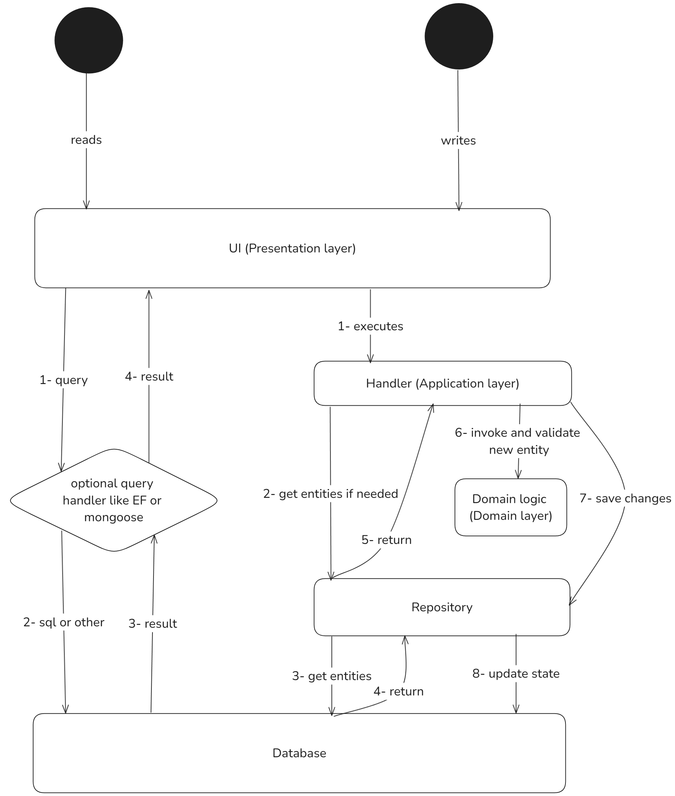

# Back-end

# Announcement

Please note that If this was a real project I would have used a more simple architecture. For a simple CRUD backend this is over engineered but I did this to showcase skills

## Clean architecture

I used the clean architecture to achieve seperataion of concerns and promotes scalability and testability

-  Domain: `packages/domain`
-  Application: `backend/application`
-  Presentation/INfrastructure: `backend/api`

As stated in the root README.md file, i put the domain in the shared workspaces because i was planning to do some unrelated experiment by sharing the domain layer with the ui but this is out of scope

## CQRS

Command Query Responsibility Segregation is a software design pattern that separates the flows of writing to the system and querying the system. 

While this seperation is often physical in a real CQRS, I implemented a logical CQRS that fits well with the clean architecture.

The main idea is that every write to the database should be validated by the domain layer, which itself is a standalone and fully testable layer that deosn't depend on non business related stuff.

## Scripts

when running dev `--inspect-brk` will ensure that a debugger is attached before running the app

remove it if you don't need to debug