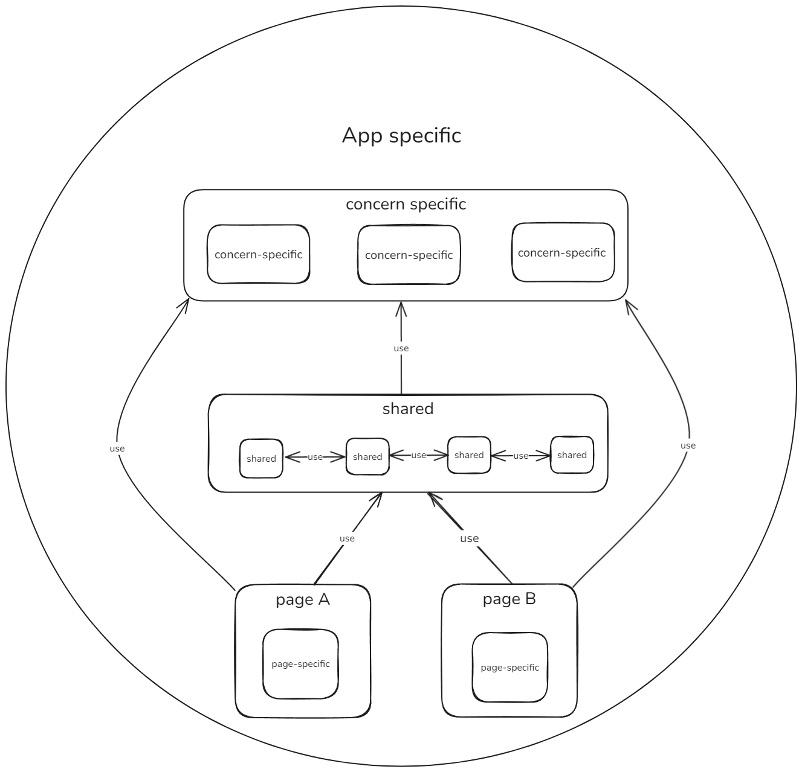

# Announcement

**Please note that there are some things I would do differently in real a project. For the reason of sticking to the requirements and showing my capabilities I didn't use a ui library and I manually implemented some stuff that are better provided by libraries like nuxt or quasar**

# Front-End Web App

## Folder structure

In this section I will explain how I structured the project (where to put components) and the reason behind that structure:

### Reason

I have worked on large complex projects with the following structure:

  - components
    - contains components that can reference any other module
  - composables
    -  contains composables that can reference any other module
  - styles
    - asd
  - utils
    - contains utils used by any other module
  - pages
    - contains the actual pages that references many modules from different folders
  - types
    - forms / modules / etc.
  - ...other files for app level stuff 

 

For ex a real and very large project I worked on had: 
- a drag and drop functionality with the below structure:
  - A `useDragAndDrop` composable that lives in `composables/` folder, a `DragAndDrop` component that lives in the `components/` folder and a `dragAndDrop` utils that lives in `utils/` folder
- forms like `AddPaymentForm` and `RegisterForm` with the following structure
  - 2 forms in `types/forms` folder using components and composables

The project was maintainable but the issue is that 1 thing like drag and drop functionality "lived" in many places, and any module has the right reason to reference any other module

### How I structured the project

The above structure I think split the modules by type. To have a more clear intention behind my folders I split by concern (or context)

There are 3 levels:

- app-specific
- concern-specific: lives in `/src/{folder}`
- shared: lives in `src/components`
- page-specific: lives in `src/routes`

**App specific** are everything around the project like requirements, ux, docs, design, external libraries, decisions

**Concern specific** are usually providers or stores that creates a context. They do not contain data related stuff. For ex: `/theme` it contains the `Theme.vue` that provides the theme, `/components/ThemeSwitcher.vue` and utils that all should be in the context (aware of) the theme. Concern specific modules preferably should not reference each other. If 2 needs to reference each other it's better to make them 1 module. `ethereum` is another example

**Shared** are components that are hoisted from page-specific. They are shared between pages and can contain data fetching and business text. This layer contains complex shared components so a reference mess is tolerated.
Ex: `Card.vue`, `Button.vue`, etc.

**Page specific** are components specific to a particular page. If one component becomes shared between 2 or more pages it is hoisted to shared-components
Ex: `home/Home.vue`, `home/components/SkillCard.vue`. If `SkillCard.vue` is needed for another page it is hoisted to shared with a more general name.

**All the components are aware of the AppContext**

**Note** that with the concern components I am not trying to create a reusable library for another project. These should be aware of the app specific stuff like languages, the requirements like the design and the dependencies like a component library. But they shouldn't reference other layers

## Approach

Please